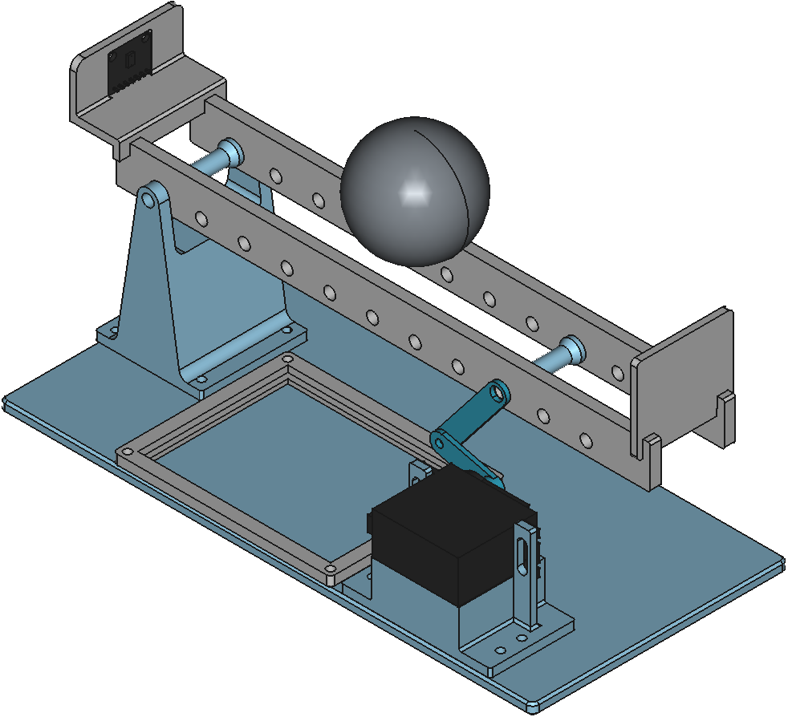
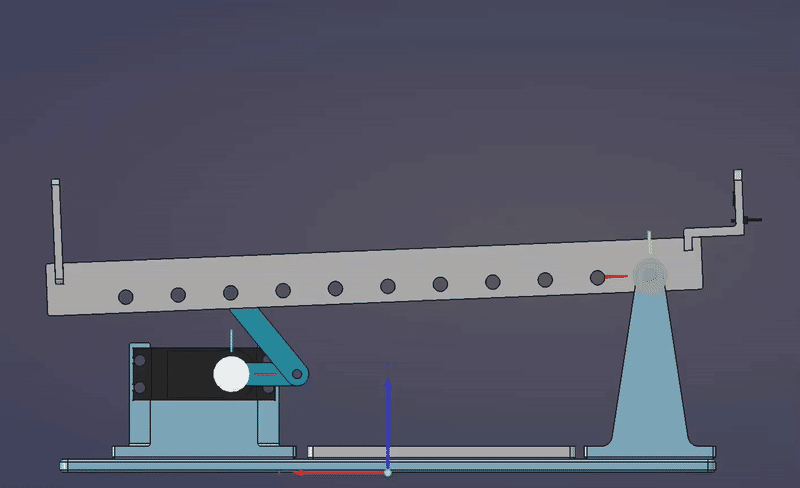
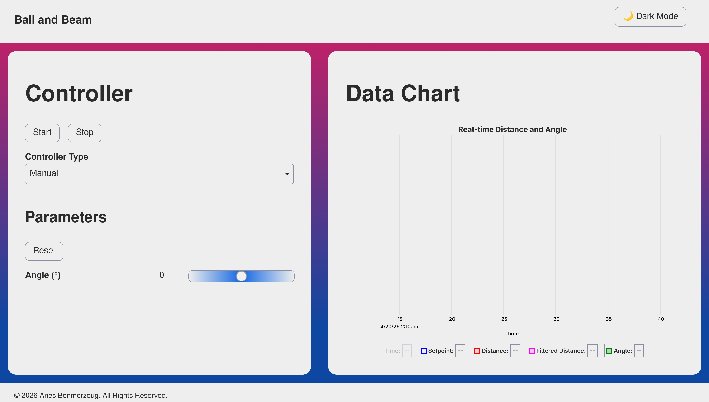

::: {.callout-note}
The full code and files for this project can be found in the following repository:
[ball-and-beam](https://github.com/AnesBenmerzoug/ball-and-beam)
:::

::: {.callout-note}
# Disclaimer

I used a local LLM to provide me feedback on the writing and to draft a few of the sections when I ran out of inspiration.
I did however write most of the post myself and verified whatever content the LLM wrote.
:::

# Introduction



In this post, I will describe an open-source ball and beam system that I designed and built from scratch.
I have had this project in mind for many years, but only started working on it at the end of 2024.
Back then, I had no idea how many design iterations and technical challanges awaited me, delaying the initial build until April 2026.

The [ball and beam system](https://en.wikipedia.org/wiki/Ball_and_beam) is a classical textbook control system
used in [research](https://link.springer.com/article/10.1007/s11071-009-9534-8) and [academic projects](https://dspace.mit.edu/bitstream/handle/1721.1/32780/57571320-MIT.pdf;sequence=2) to showcase different control and observer methods. It is a relatively simple system composed of a long beam that can be tilted with a motor (most often a servo motor or a stepper motor) to control the position of a ball that rolls along it and whose position is measured with a range sensor (most often an ultrasound sensor).

# Design

{#fig-ball-and-beam-freecad width=80%}

There are many possible variations of the system, each hinging on a few key design choices that alter the dynamics of the system.

These variations introduce specific trade-offs:

- **Servo vs. Stepper Motor:** Servos are compact, self-contained, and easy to control via PWM. Steppers deliver more raw torque but need additional drivers, limit switches, and microstepping firmware.

- **Fulcrum Position:** Centering the pivot keeps the beam balanced and simplifies PID tuning, but it requires a motor capable of swinging through larger angles without stalling.

- **Motor Placement:** Mounting the motor at or near the fulcrum simplifies the linkage and minimizes the effect of gear backlash, while mounting it at the end requires a longer lever arm that complicates the geometry and increases the effect of gear backlash.

- **Dimensions:** Bigger beams need stronger motors, longer-range sensors, and faster control loops to compensate for increased inertia and signal latency.

For my design (see @fig-ball-and-beam-freecad), I settled on a simple and straightforward compact design whose parts fit neatly inside my 3D printer.
I positioned the fulcrum and the servo motor on opposite edges of the beam. I drew inspiration from the following existing implementations:

- [Balance Beam Kit](https://careyi3.github.io/balance_beam_kit/)
- [Osinski, Cristiano, et al. "Control of ball and beam system using fuzzy PID controller." 2018 13th IEEE International Conference on Industry Applications (INDUSCON). IEEE, 2018.](https://ieeexplore.ieee.org/abstract/document/8627251)
- [Arduino PID Control System (Ball and Beam) - YouTube](https://www.youtube.com/watch?v=oy58S4beC9c)

I modeled every part from scratch in [FreeCAD](https://www.freecad.org/) and used the builtin [Assembly workbench](https://wiki.freecad.org/Assembly_Workbench)
to assemble them. This made it easy to validate the fit of the parts and the kinematics of the system before printing.

The final build includes:

- Rigid base plate.
- Fulcrum pivot block.
- Servo motor mounting bracket.
- Board platform for the perfboard containing the microcontroller and power routing.
- Distance sensor mount.
- Two-segment beam.
- End stop.
- Servo horn and linkage arm.

I chose a split beam design specifically for compatibility with simulation in MuJoCo simulation.
Because MuJoCo approximates collisions using convex hulls, a single solid beam would cause the ball to float above it.
The split design also made it easier to print flat on the build plate.

The design process was neither simple nor straightforward. I had to iterate through multiple versions, 3D printing, assembling and testing the system multiple times before I was satisfied with it. The current design incorporates the lessons I learned into a simple build that's ready to be built and used.

# Simulation

::: {#fig-simulation}

 

:::

To validate the system dynamics and perform initial controller tuning, I exported the FreeCAD assembly to MuJoCo using the [Assembly2MuJoCo](https://github.com/AnesBenmerzoug/FreeCAD-Assembly2MuJoCo/tree/main) workbench. The simulation served as a controlled testbed for validating the system dynamics and for tuning the PID gain parameters without risking mechanical damage. 

After exporting the assembly, I manually adjusted the exported MuJoCo model as follows:

- Attached a `site` to the sensor body so the ToF (Time-of-Flight) ray could accurately measure ball distance.
- Matched the simulated ball mass to `29.9 g`, the exact weight of the 3D printed ball I was planning to use.
- Configured a static camera view for a better visualization of the simulated system.

In @fig-simulation, you can see the simulated result of the system using tuned PID parameters.

While matching the simulated ball mass to the real one reduced the sim-to-real gap, several other factors caused divergence between simulation and the built system:

- **Mechanical non-idealities:** Backlash in the servo linkage and friction at the different axes of rotation.
- **Surface irregularities:** Uneven ball surfaces and beam roughness that cause the ball to stick and slip, which triggers integral windup during motion transitions.
- **Sensor limitations:** Sensor measurement noise and quantization artifacts.
- **Computational latency:** Hardware scheduling delays that introduce timing jitter into the control loop.

These differences didn't invalidate the simulation but prevented me from using the tuned PID gain parameters obtained with the simulation in the real system.

# Control

](PID_block_diagram.svg){#fig-pid-block-diagram width=80%}

In order to control the system in the simplest way, I chose to implement a Proportional-Integral-Derivative (PID) controller (see @fig-pid-block-diagram).

The controller's continuous-time control law is:

$$
u(t) = K_p * e(t) + K_i * \int e(t) + K_d * \frac{d}{dt} e(t)
$$ {#eq-pid-continuous-time}

Where:

- $u(t)$ is the control signal which corresponds to the servo motor's angle in our case.
- $e(t)$ is the position error defined as $e(t) = \text{target distance} - \text{measured distance}$.
- $K_p$ is the coefficient of the proportional part of the controller.
- $K_i$ is the coefficient of the integral part of the controller.
- $K_d$ is the coefficient of the derivative part of the controller.

Since microcontrollers sample at fixed time intervals, I couldn't use this formula directly and had to discretize it first.

::: {.callout-tip collapse="true"}
## Mathematical derivation

I avoid direct integral approximation by first differentiating @eq-pid-continuous-time:

$$
\dot{u}(t) = K_p * \frac{d}{dt}e(t) + K_i * e(t) + K_d * \frac{d^2}{dt^2} e(t)
$$ {#eq-pid-differentiated}

I then apply the [backward finite difference method](https://en.wikipedia.org/wiki/Backward_differentiation_formula) to @eq-pid-differentiated:

$$
\frac{u(t_k) - u(t_{k-1})}{h} = K_p * \frac{e(t_k) - e_{k-1}}{h} + K_i * e(t_k) + K_d * \frac{e(t_k) - 2*e_{k-1} + e_{k-2}}{h^2}
$$ {#eq-pid-backward-difference}

Where $h$ represents the step size.

Multiplying both sides of @eq-pid-backward-difference by $h$ gives us:

$$
\begin{equation}
\begin{split}
\Delta u(t_k) & = u(t_k) - u(t_{k-1}) \\ 
& = K_p * [e(t_k) - (e_{k-1})] + K_i * h * e(t_k) + \frac{K_d}{h} *  [e(t_k) - 2*e_{k-1} + e_{k-2}]
\end{split}
\end{equation}
$$ {#eq-pid-discretized-increment}

Finally, solving for $u(t_k)$ in @eq-pid-discretized-increment yields the recursive discrete-time formula:

$$
\begin{equation}
u(t_k) = u(t_{k-1}) + K_p * [e(t_k) - (e_{k-1})] + K_i * h * e(t_k) + \frac{K_d}{h} * [e(t_k) - 2*e_{k-1} + e_{k-2}]
\end{equation}
$$ {#eq-pid-incremental}

:::

$$
\begin{equation}
u(t_k) = u(t_{k-1}) + K_p * [e(t_k) - (e_{k-1})] + K_i * h * e(t_k) + \frac{K_d}{h} * [e(t_k) - 2*e_{k-1} + e_{k-2}]
\end{equation}
$$ {#eq-pid-incremental}

@eq-pid-incremental can be rewritten as:

$$
\begin{equation}
u(t_k) = P(t_k) + I(t_k) + D(t_k)
\end{equation}
$$ {#eq-pid-discrete-split}

Where:

- $P(t_k) = P(t_{k-1}) + K_p * [e(t_k) - (e_{k-1})]$
- $I(t_k) = I(t_{k-1}) + K_i * h * e(t_k)$
- $D(t_k) = D(t_{k-1}) + \frac{K_d}{h} * [e(t_k) - 2*e_{k-1} + e_{k-2}]$

@eq-pid-discrete-split is more useful from an implementation perspective, because it decouples the $P$, $I$, and $D$ updates and naturally supports anti-windup schemes.

When a PID controller gets stuck at its limits, it suffers from ["integral windup."](https://en.wikipedia.org/wiki/Integral_windup) This means the controller keeps adding up errors even when it can't actually change the output, causing the system to overshoot and take a long time to settle.

In this system, two areas are subject to hard constraints and can trigger this phenomenon:

- **Control Input Saturation**: The assembly forms what's called a crank-rocker [four-bar linkage](https://en.wikipedia.org/wiki/Four-bar_linkage) (see @fig-crank-rocker) whose input link, the servo motor arm, is a crank link meaning that it can rotate a full $360^\circ$, whereas the output link, the beam, is a rocker link meaning that it can rotate through a limited range of angles. To prevent the servo motor arm from rotating continuously we limit the angles of the servo motor to the range $[-30.0^{\circ}, 30.0^{\circ}]$ which can saturate the PID output during large disturbances.

  {#fig-crank-rocker width=80%}

- **State Constraint Saturation**: The ball's position is strictly limited on both ends by two physical stops: the sensor holder on one end which prevents the distance from becoming negative and an end stop on the other end which prevents it from rolling off the beam. This confines the ball's physical state to a finite interval, preventing out-of-bounds positioning.

Additionally, real-world imperfections can also trigger integral windup: when the ball is uneven or it encounters uneven surfaces or in the presence
of [backlash](https://en.wikipedia.org/wiki/Backlash_(engineering)), which is the case for this system because the parts are 3D printed, the controller interprets this as sustained error causing the integral term to grow unchecked until the ball breaks free, resulting in overshoot.

There are a few different solutions to mitigate this problem. I used the simplest one which is a clamping approach that stops the integral term from accumulating if it exceeds an upper, respectively lower, threshold value $I_{\text{Max}}$, respectively $I_{\text{Min}}$.

$$
I_{\text{clamped}}(t_k) = \begin{cases}
I_{\text{Max}} &, \text{if } I(t_k) > I_{\text{Max}}\\
I_{\text{Min}} &, \text{if } I(t_k) < I_{\text{Min}}\\
I(t_k) &, \text{otherwise}
\end{cases}
$$

In my case, I used $I_{\text{Max}} = 30.0$ and $I_{\text{Min}} = -30$.

This approach is computationally lightweight and proved sufficient for this system, though more advanced anti-windup methods (e.g. back-calculation or conditional integration) may be an interesting update to add to the system in a future iteration.

# Build

## Bill of Materials (BoM)

### Electronics & Sensors

| Part Name                                                                                          | Description                           | Quantity |
|----------------------------------------------------------------------------------------------------|---------------------------------------|----------|
| [ESP32-C6-WROOM-1](https://www.espressif.com/en/products/modules/esp32-c6) *                       | WiFi/BLE microcontroller devkit       | 1        |
| [VL6180](https://www.st.com/en/imaging-and-photonics-solutions/vl6180.html) **                     | Time-of-Flight (ToF) proximity sensor | 1        |
| MG 996R                                                                                            | Digital servo motor                   | 1        |
| 470 µF Electrolytic Capacitor                                                                      | Stabilize 5v power line               | 1        |

> * *: If you use another microcontroller, then you should make sure the pins are still the same.
> * **: The VL6180 is now deprecated and not recommended for new design (NRND) and may not be readily available. If you can't find it, then consider using the [VL53L4CD](https://www.st.com/en/imaging-and-photonics-solutions/vl53l4cd.html) instead.

### Fasteners & Hardware

| Part Name                                                                                          | Description                                   | Quantity |
|----------------------------------------------------------------------------------------------------|-----------------------------------------------|----------|
| M3 × 10mm Bolts and Nuts                                                                           | Mounting for fulcrum and servo bracket        | 13       |
| M8 × 60mm Bolts and Nuts                                                                           | Primary rotation axes                         | 2        |
| M5 × 10mm Flat Washers                                                                             | Friction reduction at pivot points            | 5        |

### Materials

| Part Name                                                                                          | Description                                   | Quantity |
|----------------------------------------------------------------------------------------------------|-----------------------------------------------|----------|
| 1 kg PLA Spool                                                                                     | FDM printing material for structural parts    | 1        |

## Circuit

Wiring this system requires two things: a clean power path for the servo, and noise-free I²C communication for the sensor. 

The 470 µF capacitor across the 5 V rail helps smooth out the current spikes that happen when the servo changes direction.
Without it, the ESP32 would occasionally brown out.

All ground wires connect to a single point on the board to keep the signal reference stable.

The complete wiring schematic is shown in @fig-wiring. Pin mappings are summarized in @tbl-wiring.

](wiring_diagram.svg){#fig-wiring width=30%}

| Microcontroller pin | Target pin(s) | Function |
|:--|:--|
| **5V** | Servo motor **Power**; VL6180 **VIN**; Capacitor **+** | Power supply |
| **GND** | Servo motor **GND** ; VL6180 **GND**; Capacitor **-** | Ground |
| **GPIO 15** | Servo motor **Signal** | PWM signal |
| **GPIO 9** | VL6180 **SCL** | I2C clock |
| **GPIO 8** | VL6180 **SDA** | I2C data |

: Pin Wiring {#tbl-wiring}

# Software Implementation

Building the control software was just as iterative as the mechanical design. I chose Rust as the programming language because I'm familiar with it
and for its memory safety and deterministic execution, paired with [Embassy](https://embassy.dev/)'s cooperative asynchronous runtime to manage sensor polling, control computation, and network communication on a single core.

The firmware is split into two logical layers: an embedded backend that runs directly on the ESP32-C6, and a lightweight web frontend that is served by the controller but runs in the user’s browser.

## Embedded Backend

On the microcontroller side, the backend handles peripheral initialization, WiFi provisioning, servo PWM setup, and I²C communication with the distance sensor. Rather than running everything in a single blocking loop, I structured the code around Embassy’s asynchronous task model. This keeps the system responsive without requiring a real-time OS or multiple cores.

Tasks communicate asynchronously to avoid blocking the control thread:

- **Control Loop:** Reads the sensor, filters the signal, runs the control algorithm, and adjusts the servo.
- **Parameter Task:** Listens for updates from the web interface and safely applies them to the controller.
- **Network & HTTP Tasks:** Manage the TCP/IP stack, mDNS discovery, serve the API and the web UI.

I also added a manual control mode during development, which lets me override the PID loop and send direct commands to the servo. This made bench testing and debugging much easier.

## Web Frontend

{#fig-frontend width=80%}

The user interface (see @fig-frontend) is built with [Preact](https://preactjs.com/) and bundled using [Vite](https://vite.dev/) for fast development and minimal output size.

Instead of hosting the UI on an external server, I compiled it into static assets and embedded it directly into the firmware using `build.rs` and the `include_bytes!` macro. This means the entire project is self-contained: flash the ESP32, connect to `http://ball-and-beam.local`, and you’re ready to go.

## How It All Connects

The backend and frontend communicate over a simple REST API. When you start/stop the controller or adjust parameters in the browser, the request hits the `/api/v1/controller` endpoint of the API, which triggers an async signal to wake the parameter task. That task acquires a mutex lock, updates the controller, and releases it keeping the real-time control loop uninterrupted. The control loop publishes fresh telemetry (timestamp, distance, filtered distance, angle) at a fixed interval, which the web UI fetches at a fixed interval by calling `/api/v1/data` endpoint of the API in order to display it.

```{mermaid}
%%| label: fig-sequence-diagram
%%| fig-cap: "Sequence diagram showing interaction between backend and frontend"

sequenceDiagram
    participant WebUI as Web UI
    participant API as API
    participant Sig as Data/Param Signal
    participant Params as Controller Params Task
    participant Ctrl as Control Loop
    participant Sensor as VL6180 Sensor
    participant Servo as Servo Motor

    WebUI->>API: GET /api/v1/data
    API->>Sig: wait()
    Sig-->>API: Data(timestamp, distance, filtered distance, angle)
    API-->>WebUI: JSON Response

    WebUI->>API: POST /api/v1/controller (JSON)
    API->>Sig: signal(ControllerParameters)
    Sig->>Params: wake up
    Params->>Ctrl: update Controller parameters (Mutex lock)

    Note over Ctrl,Servo: CONTROL LOOP (fixed interval)
    Ctrl->>Sensor: read distance
    Ctrl->>Ctrl: Filter distance measurement
    Ctrl->>Ctrl: compute Controller output
    Ctrl->>Servo: set servo motor angle
    Ctrl->>Sig: signal(new Data)
```

# Future Improvements

While the current version is fully functional, it is far from complete. It can be improved in many different ways and I'm planning
to implement at least some of them in future iterations.

What follows is a non-exhaustive list of improvement ideas that I currently have in mind:

- **Lower Friction Rotations:** Use ball bearings at the fulcrum and pivot points to reduce stiction and shaft runout.
- **Configurable mounting:** Add more possible placements for the motor mounting bracket to support alternative linkage geometries and actuator placements.
- **More realistic simulation:** Update the MuJoCo model with real-world mass, friction, and damping parameters. Incorporate backlash and joint compliance models.
- **Decoupled control loops:** Run sensor polling and filtering in a dedicated high-frequency task, separating I/O latency from the control computation.
- **Externalized UI:** Develop a separate application for the UI using, for example, [Tauri](https://tauri.app/) to free up ESP32 flash and RAM while making firmware updates and UI iterations far easier.
- **Advanced control algorithms:** Implement additional control methods like:
    - Reinforcement Learning for adaptive tuning.
    - Sliding Mode and Back-stepping controllers for robustness against nonlinearities.
    - Koopman operator methods for global linearization and predictive control.
- **Kalman filter**: Implement [Kalman filter](https://en.wikipedia.org/wiki/Kalman_filter) to improve distance measurements and maybe estimate other system parameters (e.g. ball rotational and translational speed).

# Conclusion

I have finally finished the first version of my ball and beam system and open-sourced it on [Github]((https://github.com/AnesBenmerzoug/ball-and-beam))
hoping that it may be useful to someone else. It took a considerable amount of time to iterate through the mechanical, electrical and software challenges,
but the final result made the effort worthwhile.

I will now take a break from it and work on another project from my backlog, but I will hopefully come back to it because I would
like to at least implement a few of the improvement ideas.
