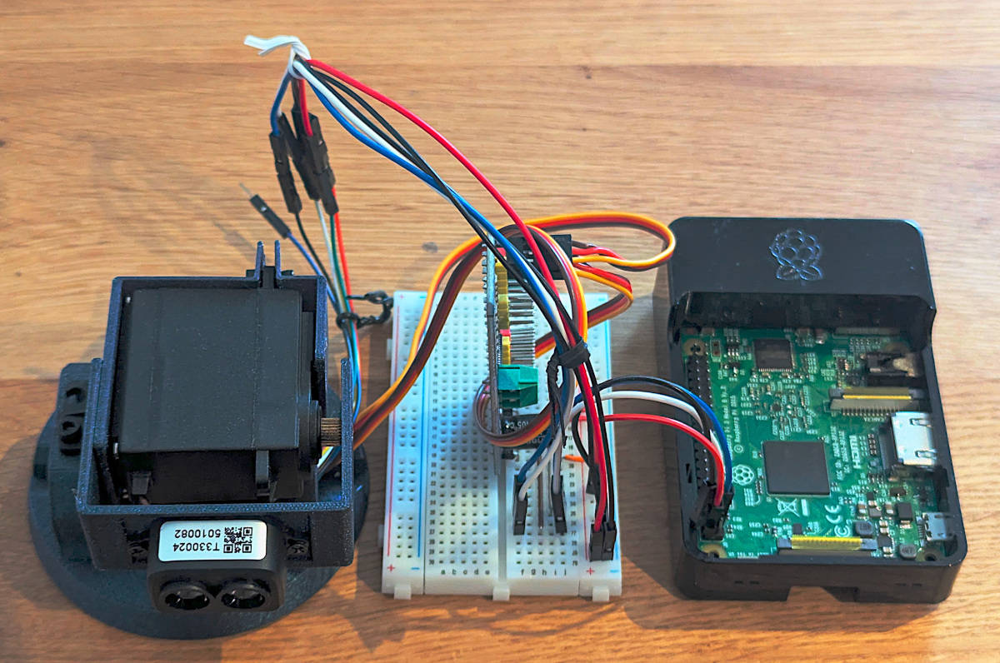
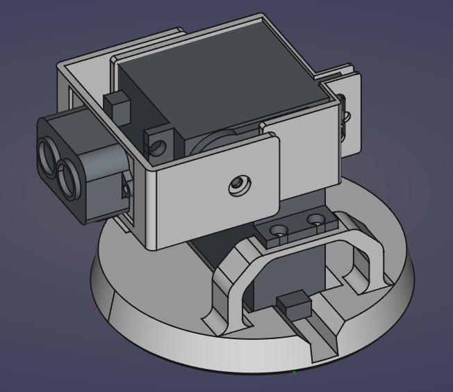
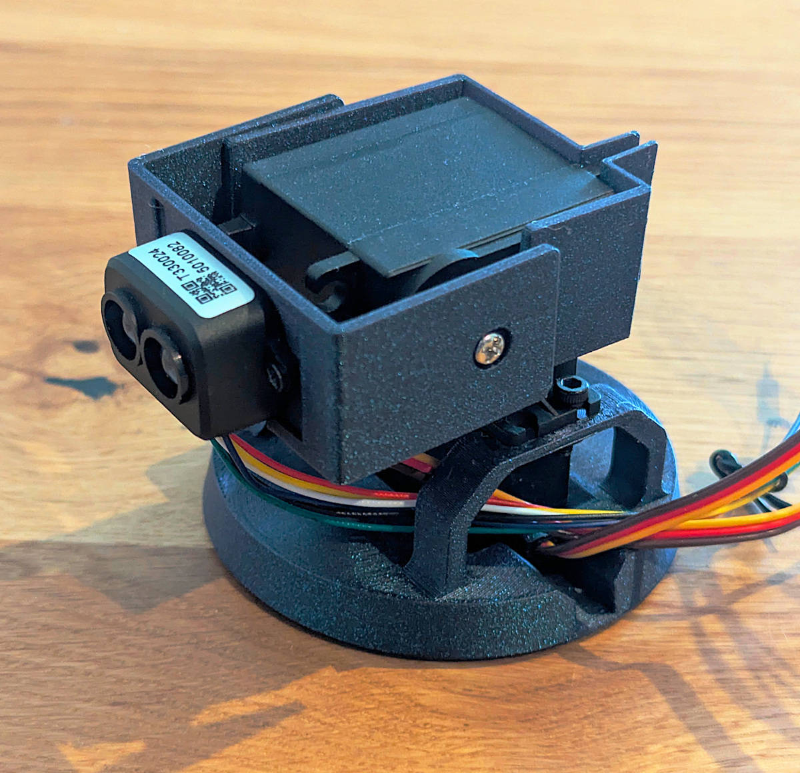
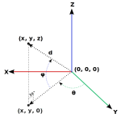

::: {.callout-note}
The full code for this project/experiment can be found in the following repository:
[rpi-tfluna-lidar](https://github.com/AnesBenmerzoug/rpi-tfluna-lidar)
:::

# Introduction

{#fig-tfluna-pan-tilt-raspberrypi width=80%}

In [my previous post](../rpi-tfluna-lidar/) about the TF-Luna LiDAR distance sensor, I showed what it is and how to use it with a Raspberry Pi.

After publishing it, I took some time to develop and publish the [embedded-tfluna](https://crates.io/crates/embedded-tfluna) crate specifically for it. It is platform agnostic and works in no-std environments. However, it only supports I2C communication for now because that's what I used.

I still wanted to play around a bit more with the sensor, so I created, designed and printed a pan-tilt mechanism that uses 2 servo motors in order to rotate the sensor around and capture the distance of different points in space in order to create a point cloud (@fig-tfluna-pan-tilt-raspberrypi).

Before diving into the details, I would like to first describe what a point cloud is and why I would need one.

A point cloud is a discrete set of data points in space. The points may represent a 3D shape or object. Each point position has its set of Cartesian coordinates ($x$, $y$, $z$). Points may contain data other than position such as RGB colors, normals, timestamps and others. Point clouds are generally produced by 3D scanners or by photogrammetry software, which measure many points on the external surfaces of objects around them.

They are used for many purposes; the one I care about personally is autonomous vehicles. I want to make a mobile robot that navigates autonomously around rooms with the use of a LiDAR sensor and SLAM (Simultaneous Localization And Mapping).

# Pan-Tilt Mechanism

Getting to the final pan-til mechanism was not an easy task. I tried a few different solutions before comming up with the final one.

I first started by ordering a cheap pan-tilt mechanism from AliExpress (@fig-cheap-pan-tilt) hoping that it would be enough given that the sensor itself is very light. Unfortunately, the two micro servos that came with it were either broken or defect and wouldn't hold their position. They instead kept rotating continuously. On top of that, the pan-tilt mechanism was pretty flimsy.

{#fig-cheap-pan-tilt width=80%}

So I gave up on that and decided to look for a better mechanism with better servo motors. I ordered a second that I found on a website whose name I forgot. That one unfortunately came with a continuous rotation servo which I couldn't use.

In the end, I decided to build my own mechanism and used 2 servo motors that I had ordered for another project.

It took so long to finalize this project that I learned to use FreeCAD, bought a 3D printer (a Centauri Carbon, for those that are curious) and ended up modeling the pan-tilt mechanism myself (@fig-tfluna-pan-tilt-freecad-design) (I actually reused an assembly that I created for another project of mine [FreeCAD-Assembly2MuJoCo](https://github.com/AnesBenmerzoug/FreeCAD-Assembly2MuJoCo) about which I will write a blog post hopefully after this one).

{#fig-tfluna-pan-tilt-freecad-design width=80%}

I printed it with Elegoo's Galaxy Blue PLA and it came out looking great (@fig-tfluna-pan-tilt-printed).

{#fig-tfluna-pan-tilt-printed width=80%}

Once that was done, I connected the 2 servos to a [PCA9685](https://www.nxp.com/docs/en/data-sheet/PCA9685.pdf) module in order to control them using I2C just like for the TF-Luna sensor.

](tfluna_pan_tilt_wiring_diagram.svg){#fig-tfluna-pan-tilt-wiring-diagram width=80%}

Just like for my previous post, I wrote the code in Rust, and used Rerun to store the data. I cross-compiled it on my laptop and copied and ran it on a Raspberry Pi using SSH with a Rerun server running on my laptop.

# Point Cloud Creation

To create a point cloud, we have to rotate the sensor around, take distance measurements and convert each measurement into Cartesian coordinates. 

In this mechanism, we control the angles of both servo motors (yaw ($\theta$) for the bottom one and pitch ($\phi$) for the top one) and can measure distance ($d$) to a specific point in space.

{#fig-point-position-diagram width=80%}

In order to get a point's position from these parameters and measurements, we use the following formulas:

$$
\left[ \begin{matrix}x \\ y \\ z \end{matrix}\right] =
\left[ \begin{matrix}
d * \cos(\phi) * \sin(\theta) \\
d * \cos(\phi) * \cos(\theta) \\
d * \sin(\phi)
\end{matrix}\right]
$$

Where we consider the center of the coordinate system $(0, 0, 0)$ to coincide with the position of the sensor.

# Experiment

## Experimental Setup

Before using the mechanism to create point clouds, 
I wanted to see how fast and accurate it can be. For that, I put the mechanism on a table and pointed it at a wall at a distance of 20 centimeters and limited the yaw angle (left and right movement) to the range $[-30^\circ, 30^\circ]$ inclusive and the pitch angle (up and down movement) to the range $[0^\circ, 30^\circ]$ inclusive. The pitch angle only goes down to $0^\circ$ because otherwise it would measure the distance to the table on which it was put.

Since I know that the wall is flat and that it is at a distance of 20 centimeters from the sensor, we can represent it as a plane in 3D space with the equation:

$$
y = 20
$$

I am assuming that the y-axis runs from the mechanism to the wall, the z-axis runs from the mechanism to the ceiling and finally the x-axis runs from the mechanism to the right when facing the wall.

## Plane Detection

The standard general form of a plane in 3D is given by the equation: 
$$
ax + by + cz + d = 0
$$

Where $a, b, c, d \in \mathbb{R}$ are the coefficients that define the plane and $x, y, z \in \mathbb{R}$ are the coordinates of points in 3D space.

To avoid the degenerate solution $a = 0, b = 0, c = 0, d = 0$ and since we know that $d \neq 0$, we divide everything by $d$ to get new coefficients:

$$
a^\prime = \frac{a}{d}, 
b^\prime = \frac{b}{d},
c^\prime = \frac{c}{d}
$$

The equation then becomes:

$$
a^\prime x + b^\prime y + c^\prime z + 1 = 0
$$

If we take multiple measurements of different points, we obtain a system of equations that can be represented as:

$$
A\Theta=b
$$

Where $A = \left[ \begin{matrix}
x_1 & y_1 & z_1\\
x_2 & y_2 & z_2\\
& \dots\\
x_n & y_n & z_n
\end{matrix} \right]$,
$b = \left[ \begin{matrix}
-1\\
-1\\
\dots\\
-1
\end{matrix} \right]$,
$\Theta = \left[ \begin{matrix}
a^\prime\\
b^\prime\\
c^\prime
\end{matrix} \right]$

To solve this system of equations we use SVD (Singular Value Decomposition). We first decompose the matrix $A$ as:

$$
A = U \Sigma V^T
$$

Where:

- $U$ is an $m \times n$ orthogonal matrix.
- $\Sigma$ is an $n \times n$ diagonal matrix.
- $V$ is an $n \times n$ orthogonal matrix.

The solution is then given:

$$
\Theta = V \Sigma^{+} U^T b
$$

Where $\Sigma^{+}$ represents the pseudo-inverse (Moore-Penrose inverse).

## Optimization and Results

There are two main parameters that determine the speed of measurements:

- **angle step size**: The step size in degrees of the rotation of each servo motor.
- **servo motor delay**: The delay in milliseconds to wait after issuing a servo motor movement command before taking a measurement.

I tried different combinations of these parameters, collected the data, computed the parameters and a few metrics and plotted the results:



As we can see from the plot, the best compromise between speed and accuracy comes from the two combinations of parameters:

- **angle step size**: 1 degree, **servo motor delay**: 50 milliseconds.
- **angle step size**: 5 degrees, **servo motor delay**: 50 milliseconds.

# Example Point Cloud

After the experiment, I pointed the mechanism at something more interesting—specifically a bookshelf—and generated a point cloud. To ensure high detail, I maintained the settings from the best test case: an angle step size of 1 degree and a servo motor delay of 50 ms.



The resulting cloud successfully reconstructs the structure of the bookshelf and highlights how the mechanism captures some of the fine details. While it is slow, it has a sufficient resolution to distinguish between the bookshelf, its shelves and the wall.

# Conclusion

It is clear that the pan-tilt TF-Luna assembly has its limits when it comes to speed, which means it likely won't be suitable for high-speed autonomous navigation. However, building this mechanism and creating the point clouds was a great learning experience for me in many aspects.

I may try again to push the mechanism to its limits, perhaps by limiting the rotation to the z-axis to make it faster.

For now, that concludes my exploration of the TF-Luna sensor. I will go back to some of the projects that I started or pick up a new one from my backlog.
