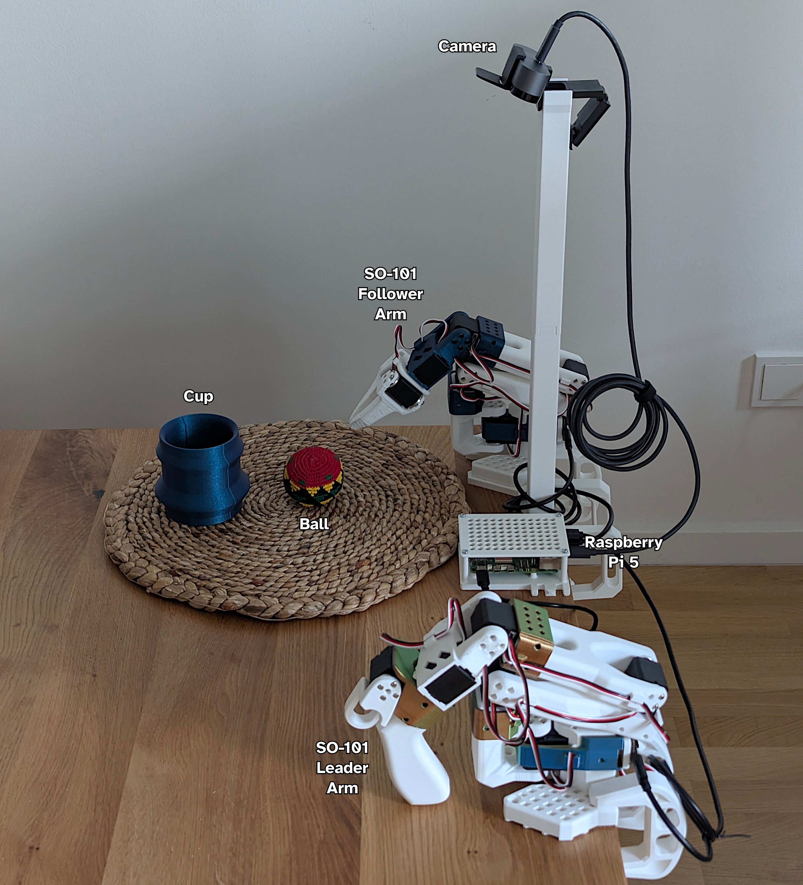

::: {.callout-note}
# Disclaimer

I used a local LLM for feedback on the writing and to draft a few of the sections when I ran out of inspiration.
I did however write most of the post myself and verified whatever content the LLM wrote.
:::

# Introduction

In this post, I document the steps I took to set up a robotic system consisting of an SO-101 follower/leader arm pair, a Logitech Brio webcam, and a Raspberry Pi 5 and  uses the [LeRobot](https://huggingface.co/docs/lerobot/index) library for controlling the robot arms, data collection and policy training and inference.

My long-term goal is to build a system that can play chess using the robot arm against a human.
The system would make use of ROS2 to split the different components into nodes (e.g. robot arm node, camera node, inference node, visualization node) that communicate between each other through message passing.

This serves mostly as a form of personal note taking and covers the initial setup: establishing a reliable data collection and policy deployment pipeline using a simpler ball-in-cup task. I decided to share it in case it proves useful to someone else.

While experimenting with the [LeRobot](https://huggingface.co/docs/lerobot/index) library, I encountered a few bugs and submitted two PRs to fix them ([#3571](https://github.com/huggingface/lerobot/pull/3571), [#3593](https://github.com/huggingface/lerobot/pull/3593)), which I hope will be merged soon enough.

# Hardware

The hardware I used for the system is:

- **SO-101 motor kit**: I bought the kit without 3D printed parts from [SeeedStudio.](https://www.seeedstudio.com/SO-ARM101-Low-Cost-AI-Arm-Kit-p-6426.html)
- **SO-101 3D printed parts**: I printed [the parts](https://github.com/TheRobotStudio/SO-ARM100/tree/main/STL/SO101) on my own because I have a 3D printer and wanted to choose colors freely.
- **Raspberry Pi 5 4GB**: I had one that a friend gifted me for my birthday (Thanks, Oussama!)
- **Logitech Brio webcam**: My daily driver, repurposed for robot vision.

# Raspberry Pi Setup

## OS and Dependencies

For this project, I decided to use Ubuntu 24.04 on the Pi instead of the more typical choice of Raspberry Pi OS,
because it has first-class support of ROS2 which I'm planning to use in later parts of the project.

Here's what I did to set it up:

- Flashed Ubuntu 24.04 on an SD card using [Raspberry Pi Imager](https://www.raspberrypi.com/software/).
- Plugged in keyboard, mouse, and screen for the initial setup and configuring wifi access. I unplugged them once SSH access was set up.
- Installed [FFmpeg](https://ffmpeg.org/) for video encoding.
- Installed and enabled `openssh-server` to access the Pi remotely.
- Installed `avahi` for enabling [mDNS](https://en.wikipedia.org/wiki/Multicast_DNS) on the Pi to access it remotely within needing its IP address.

## Remote Connectivity & SSH Configuration

Since the Pi will operate without a monitor, I set up secure SSH access immediately:

- Generated an SSH keypair on my workstation.
- Copied the public key using `ssh-copy-id pi@<ip>`
- Disabled password authentication in `/etc/ssh/sshd_config`
- Configured mDNS by following instructions from [this post](https://oneuptime.com/blog/post/2026-01-15-configure-mdns-avahi-ubuntu/view) so I can connect to the Pi via `ssh pi@rpi-robotarm.local`
- Added an entry in my workstation's ssh configuration file (`~/.ssh/config`) with X11 forwarding for easier GUI debugging and SSH access.

::: {.callout-tip collapse="true"}
### ~/.ssh/config

  ```default
  Host rpi-robotarm
      Hostname rpi-robotarm.local
      User pi
      PreferredAuthentications publickey
      IdentityFile ~/.ssh/id_ed25519_rpi
      ForwardX11 yes
  ```
:::

## Changing Camera Zoom and Field-of-View

I needed a wider view to capture the full workspace. Unfortunately, Logitech's official configuration tools are Windows-only. Fortunately for me, I found the open-source [Camera Controls](https://github.com/soyersoyer/cameractrls) tool which fills the gap on Linux.

I set the zoom to 100% and adjusted the FoV to 90° for a wide enough view of the workspace.

# SO-101

The SO-101 is an open-source, affordable robot arm designed by the [RobotStudio](https://www.therobotstudio.com/) in collaboration with [Hugging Face](https://huggingface.co/lerobot). I followed the official LeRobot [SO-101 tutorial](https://huggingface.co/docs/lerobot/so101) for assembly and motor initialization and setup. The documentation is thorough if a bit confusing at times.

::: {.callout-tip}
## 3D Printing Note

Some of the the SO-101's STL files require support structures to print correctly. If you're printing these yourself, consider printing in different orientations and changing some of the print parameters (e.g. layer height, support type) to improve print quality.
:::

## Setup and calibration

I created a virtual environment and installed LeRobot and its dependencies:

```bash
python -m venv .venv
source .venv/bin/activate
pip install "lerobot[feetech,dataset,hardware]==0.5.1"
```

For simple use cases like this one, I prefer using venv directly instead of a proper package manager like poetry or uv (the latter of which I don't like because Astra, the company that created and develops it, was acquired by OpenAI).

All following commands assume we are in the virtual environment created above.

To make sure that everything was installed correctly, we can run:

```bash
lerobot-info
```

::: {.callout-tip collapse="true"}
### lerobot-info output
```bash
  - LeRobot version: 0.5.2
  - Platform: Linux-7.0.4-200.fc44.x86_64-x86_64-with-glibc2.43
  - Python version: 3.12.12
  - Huggingface Hub version: 1.14.0
  - Transformers version: N/A
  - Datasets version: 4.8.5
  - Numpy version: 2.4.3
  - FFmpeg version: 8.0.1
  - PyTorch version: 2.10.0+rocm7.13.0a20260417
  - Torchcodec version: 0.10.0
  - Is PyTorch built with CUDA support?: True
  - Cuda version: None
  - GPU model: Radeon 8060S Graphics
  - Using GPU in script?: <fill in>
  - lerobot scripts: ['lerobot-calibrate', 'lerobot-dataset-viz', 'lerobot-edit-dataset', 'lerobot-eval', 'lerobot-find-cameras', 'lerobot-find-joint-limits', 'lerobot-find-port', 'lerobot-imgtransform-viz', 'lerobot-info', 'lerobot-record', 'lerobot-replay', 'lerobot-rollout', 'lerobot-setup-can', 'lerobot-setup-motors', 'lerobot-teleoperate', 'lerobot-train', 'lerobot-train-tokenizer']
```
:::

### Finding usb ports

The first step after installing the dependencies, is to find the right USB ports for the motor controllers and the camera.

#### Motor bus

For the motor controllers, I plugged them in, powered them on and ran the following command:

```bash
lerobot-find-port
```

This lists all possible ports and then asks to disconnect one of the motor controllers and then to press `Enter` on the keyboard. Once done and if there was no issue, it prints the corresponding USB port.

For me, it detected `/dev/ttyACM0` as the port for the follower arm and `/dev/ttyACM1` as the port for the leader arm.

After seeing the detected ports, I was curious about the meaning of `ACM` and did a bit of research and found information in [this blog post from 2013](https://rfc1149.net/blog/2013/03/05/what-is-the-difference-between-devttyusbx-and-devttyacmx/). It apparently stands for Abstract Control Model[^1] which is a protocol defined in the USB CDC (Communications Device Class) specification originally meant for modem hardware that can be used in USB devices to exchange data with a computer.

[^1]: https://en.wikipedia.org/wiki/USB_communications_device_class

#### Camera

For the camera, I plugged it in and ran the following command:

```bash
lerobot-find-camera
```

The script is supposed to detect all video devices and then go through them one by one and do the following: connect, take a picture, save it on disk and then disconnect.

For me it detected two video devices, but only one of them worked at first and not the one I wanted, because of bugs I found in the code that I fixed locally and for which I submitted two PRs to the project repository ([#3571](https://github.com/huggingface/lerobot/pull/3571), [#3593](https://github.com/huggingface/lerobot/pull/3593)).

With the bugs fixed, both virtual devices worked.

::: {.callout-tip collapse="true"}
##### lerobot-find-camera output
```bash
--- Detected Cameras ---
Camera #0:
  Name: OpenCV Camera @ /dev/video0
  Type: OpenCV
  Id: /dev/video0
  Backend api: V4L2
  Default stream profile:
    Format: 0.0
    Fourcc: YUYV
    Width: 640
    Height: 480
    Fps: 30.0
--------------------
Camera #1:
  Name: OpenCV Camera @ /dev/video2
  Type: OpenCV
  Id: /dev/video2
  Backend api: V4L2
  Default stream profile:
    Format: 0.0
    Fourcc: GREY
    Width: 340
    Height: 340
    Fps: 30.0
--------------------
Image capture finished. Images saved to outputs/captured_images
```
:::


### Setting motor IDs

After getting the ports of the motor controllers, I moved on to assigning a unique ID to each motor for each arm as well as setting the same baudrate to all motors and controllers with the following two commands:

```bash
lerobot-setup-motors --robot.type=so101_follower --robot.port=/dev/ttyACM0
```

```bash
lerobot-setup-motors --teleop.type=so101_leader --teleop.port=/dev/ttyACM1
```

I had to do this because brand new motors come preconfigured with an ID of to `1`, which creates conflicts during the communication between the controller and the motors.

Each of the commands, will ask you to connect a single motor at a time to the controller starting from the gripper/handle motor and ending at the shoulder pan motor.

### Calibrating the motors

Once that was done, I had to calibrate the motors to ensure that the leader and follower arms have the same position values when they are in the same physical position. 

```bash
lerobot-calibrate --robot.type=so101_follower --robot.port=/dev/ttyACM0 --robot.id=follower_arm
```

```bash
lerobot-calibrate --teleop.type=so101_leader --teleop.port=/dev/ttyACM1 --teleop.id=leader_arm
```

Each command will asks to first move the joints of the corresponding arm to the middle of their range, press `Enter` on the keyboard and then to move them through their entire range of movement.

The calibration profiles are saved under `~/.cache/huggingface/lerobot/calibration/robots/so_follower/follower_arm.json` and `~/.cache/huggingface/lerobot/calibration/teleoperators/so_leader/leader_arm.json`

### Teleoperation

Finally, to test that everything works as expected, I used the following command:

```bash
lerobot-teleoperate \
    --robot.type=so101_follower \
    --robot.port=/dev/ttyACM0 \
    --robot.id=follower_arm \
    --teleop.type=so101_leader \
    --teleop.port=/dev/ttyACM1 \
    --teleop.id=leader_arm
```

The leader arm (with the handle) should now control the follower arm (with the gripper) in real-time.

I ran into some issues at this step and had to redo some of the previous steps. For example, at some point the command complained about a mismatch between the calibration file for one of the arms and the detected motors. Some of the motors were somehow disconnected and wouldn't work any more. I had to disconnect and reconnect them one by one and redo the calibration.

# Imitation Learning

After the setup and calibration, I went to the [Imitation Learning on Real-World Robots](https://huggingface.co/docs/lerobot/il_robots) tutorial in order to train a policy for the robot arm using Imitation Learning.

Imitation learning is a reinforcement learning approach where an agent learns to perform a task by supervised learning from expert demonstrations[^2]

I chose to use ACT (Action Chunking with Transformers) for this task because it's fast, lightweight, and surprisingly effective for fine manipulation and is also the recommended method by the LeRobot documentation for manipulation tasks[^3].

It was introduced in "Learning fine-grained bimanual manipulation with low-cost hardware"[^4]. What makes it different from previous imitation learning approaches like Behavioral Cloning (BC)[^5] and its variants, is the introduction of *action chunking* and *temporal ensembling* (See  @fig-act-action-chunk-temporal-ensemble).

::: {#fig-act-details layout-nrow=2}

{#fig-act-architecture}

{#fig-act-action-chunk-temporal-ensemble}

**Left**: Illustration of CVAE encoder and decoder components.
**Right**: Illustration of Action Chunking and Temporal Ensembling[^4].

:::

Action chunking consists of having the policy predict a chunk of actions of size $k > 1$ at each time step instead of predicting a single action in order to reduce the compounding errors of imitation learning and to help with non-markovian behaviour in human demonstrations such as pauses in the middle of a demonstration. Temporal ensembling consists in combining predicted actions from $k$ steps for the time step by averaging them using an exponential weighting scheme $w_i = exp(−m ∗ i)$, where $w_0$ is the weight for the oldest action. The speed for incorporating new observation is governed by $m$, where a smaller value means faster incorporation. 

[^2]: https://en.wikipedia.org/wiki/Imitation_learning
[^3]: https://huggingface.co/docs/lerobot/act
[^4]: Zhao, Tony Z., et al. ["Learning fine-grained bimanual manipulation with low-cost hardware."](https://arxiv.org/abs/2304.13705) arXiv preprint arXiv:2304.13705 (2023).
[^5]: Pomerleau, Dean A. ["Alvinn: An autonomous land vehicle in a neural network."](https://proceedings.neurips.cc/paper/1988/file/812b4ba287f5ee0bc9d43bbf5bbe87fb-Paper.pdf) Advances in neural information processing systems 1 (1988).

## Task

The task I decided to use consists of having the follower arm grab a ball that is in view of the camera and put it inside a cup (see @fig-ball-cup-setup).

The leader arm will be used to teleoperate the follower arm to complete the task during data collection.

{#fig-ball-cup-setup width=80%}

## Data Collection

Before training a policy, we need expert demonstrations. I wouldn't necessarily call myself an expert, but I'm the best the robot has. The ACT papers recommends recording around 50 episodes for training a policy.

::: {.callout-tip}
If you want to replicate this experiment, make sure to vary the ball and cup positions across episodes. Diverse scenarios lead to a more robust policy.
:::

To run the data collection, I used the following command:


```sh
lerobot-record \
    --robot.type=so101_follower \
    --robot.port=/dev/ttyACM0 \
    --robot.id=follower_arm \
    --robot.cameras="{ front: {type: opencv, index_or_path: 0, width: 640, height: 480, fps: 30, warmup_s: 2}}" \
    --teleop.type=so101_leader \
    --teleop.port=/dev/ttyACM1 \
    --teleop.id=leader_arm \
    --dataset.repo_id=ball-cup \
    --dataset.num_episodes=50 \
    --dataset.episode_time_s=30 \
    --dataset.reset_time_s=10 \
    --dataset.single_task="Put ball in cup" \
    --dataset.streaming_encoding=true \
    --dataset.encoder_threads=2 \
    --dataset.push_to_hub=False
```

This goes through to process of data recording for 50 episodes (`--dataset.num_episodes=50`), each of which is 30 seconds long (`--dataset.episode_time_s=30`) with a 10 second delay in between each episode to allow resetting the environment (`--dataset.reset_time_s=10`).

I explicitly disabled pushing the HuggingFace hub (`--dataset.push_to_hub=False`), because I don't want to share a dataset that contains a recording of parts of my apartment. To be honest, I would have expected this to be the default and not the other way around.

In @fig-ball-cup-demonstrations, you can see example demonstration from my data collection process.

::: {#fig-ball-cup-demonstrations}



Sample demonstrations from data collection.

:::

## Training

Once the data collection was completed, I copied the dataset over from the PI to my workstation to train a model using it's GPU.

```bash
lerobot-train \
    --dataset.repo_id=ball-cup_20260512_093538 \
    --output_dir=outputs/train/act_so101_ball_cup \
    --job_name=act_so101_ball_cup \
    --policy.push_to_hub=False \
    --policy.type=act \
    --policy.repo_id=ball_cup_policy \
    --policy.device=cuda
```

Once again, I explicitly disabled pushing the HuggingFace hub (`--policy.push_to_hub=False`).

The training took around 7 hours to finish, which is slower than I expected and can probably be attributed to using an AMD APU, namely the Ryzen™ AI Max+ 395, and ROCm.

## Inference

Finally, I copied the last checkpoint of the training from my workstation to the PI and used this command to run inference:

```bash
lerobot-rollout \
    --strategy.type=base \
    --policy.path=/home/pi/projects/lerobot/output/train/act_so101_ball_cup/checkpoints/last/pretrained_model/ \
    --robot.type=so101_follower \
    --robot.port=/dev/ttyACM0 \
    --robot.id=follower_arm \
    --robot.cameras="{ front: {type: opencv, index_or_path: 0, width: 640, height: 480, fps: 30, warmup_s: 2}}" \
    --task="Put ball in cup" \
    --duration=30
```

I was a bit worried that my Pi wouldn't be able to handle the inference part, either because of the lack of memory (it only has 4GBs of RAM) or because of its weak CPU, but it managed to run it without an issue as you can see in @fig-ball-cup-policy.

::: {#fig-ball-cup-policy}



Demonstration of trained policy successfully completing the task.

:::

The policy works, but it's not fully robust. Some rollouts succeeded, while others failed due to release timing, trajectory hesitation or the specific setup missing from the training dataset. In a follow-up post, I'll experiment with data augmentation, hyperparameter tuning, as well as other methods.

# Conclusion

This was the first phase of the project. I assembled and set up everything, confirmed that the system works and went through all the steps (data collection, training, rollout or inference) that lead to a working trained policy.

In follow-up posts, I will try to further extend and play with the system by following this rough roadmap:

- **Policy refinement**: Add data augmentation (randomized lighting, perspective shifts, jittered start positions) and run a hyperparameter sweep on the ACT chunk size and lookahead window with the aim of increasing the policy's success rate and robustness.
- **Chess perception**: Use the camera to detect the board state and classify piece positions. I will most likely start with a simple approach based on heuristics and if that doesn't work at all or not well enough then I would move towards fine-tuning a lightweight YOLO model.
- **Chess planning**: Use a chess engine, most likely [stockfish](https://stockfishchess.org/), to plan the next move and detect any illegal moves made by the human player.
- **Chess movement**: Train a policy to move the chess pieces based on the planning.
- **Modular architecture**: Decouple perception, planning, and control into independent ROS2 nodes that communicate through message passing.
- **Closed-loop play**: Test against a human. Track win/draw/loss ratios, log failure states, and iterate on the different layers.
